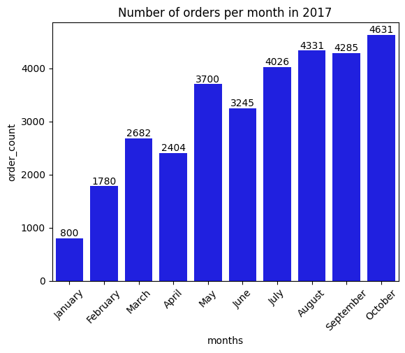

# ECOMPROJECT PYTHON+SQL


```python
import pandas as pd
import matplotlib.pyplot as plt
import seaborn as sns
import mysql.connector


db = mysql.connector.connect(host = "localhost",
                            username = "root",
                            password = "9885",
                            database = "ecomproject1")

cur = db.cursor()
```

# number of orders placed in 2018


```python
query = """ select count(order_id) from orders where year(order_purchase_timestamp) = 2018 """

cur.execute(query)

data = cur.fetchall()

"Total orders placed in 2018 are", data[0][0]
```


    ('Total orders placed in 2018 are', 54011)


#   unique cities where customers are located.


```python
query = """ select distinct customer_city from customers """

cur.execute(query)

data = cur.fetchall()

df = pd.DataFrame(data)
df.head()
```


<div>
<style scoped>
    .dataframe tbody tr th:only-of-type {
        vertical-align: middle;
    }

    .dataframe tbody tr th {
        vertical-align: top;
    }

    .dataframe thead th {
        text-align: right;
    }
</style>
<table border="1" class="dataframe">
  <thead>
    <tr style="text-align: right;">
      <th></th>
      <th>0</th>
    </tr>
  </thead>
  <tbody>
    <tr>
      <th>0</th>
      <td>franca</td>
    </tr>
    <tr>
      <th>1</th>
      <td>sao bernardo do campo</td>
    </tr>
    <tr>
      <th>2</th>
      <td>sao paulo</td>
    </tr>
    <tr>
      <th>3</th>
      <td>mogi das cruzes</td>
    </tr>
    <tr>
      <th>4</th>
      <td>campinas</td>
    </tr>
  </tbody>
</table>
</div>


#  Percentage of orders that were paid in installments


```python
query = """ select ((sum(case when payment_installments >= 1 then 1
else 0 end))/count(*))*100 from payments
"""

cur.execute(query)

data = cur.fetchall()

"Percentage of orders that were paid in installments is", data[0][0]
```


    ('Percentage of orders that were paid in installments is', Decimal('99.9981'))


# Total sales per category


```python
query = """ select upper(products.product_category) category, 
round(sum(payments.payment_value),2) sales
from products join order_items 
on products.product_id = order_items.product_id
join payments 
on payments.order_id = order_items.order_id
group by category
"""

cur.execute(query)

data = cur.fetchall()

df = pd.DataFrame(data, columns = ["Category", "Sales"])
df
```


<div>
<style scoped>
    .dataframe tbody tr th:only-of-type {
        vertical-align: middle;
    }

    .dataframe tbody tr th {
        vertical-align: top;
    }

    .dataframe thead th {
        text-align: right;
    }
</style>
<table border="1" class="dataframe">
  <thead>
    <tr style="text-align: right;">
      <th></th>
      <th>Category</th>
      <th>Sales</th>
    </tr>
  </thead>
  <tbody>
    <tr>
      <th>0</th>
      <td>PERFUMERY</td>
      <td>506738.66</td>
    </tr>
    <tr>
      <th>1</th>
      <td>FURNITURE DECORATION</td>
      <td>1430176.39</td>
    </tr>
    <tr>
      <th>2</th>
      <td>TELEPHONY</td>
      <td>486882.05</td>
    </tr>
    <tr>
      <th>3</th>
      <td>BED TABLE BATH</td>
      <td>1712553.67</td>
    </tr>
    <tr>
      <th>4</th>
      <td>AUTOMOTIVE</td>
      <td>852294.33</td>
    </tr>
    <tr>
      <th>...</th>
      <td>...</td>
      <td>...</td>
    </tr>
    <tr>
      <th>69</th>
      <td>CDS MUSIC DVDS</td>
      <td>1199.43</td>
    </tr>
    <tr>
      <th>70</th>
      <td>LA CUISINE</td>
      <td>2913.53</td>
    </tr>
    <tr>
      <th>71</th>
      <td>FASHION CHILDREN'S CLOTHING</td>
      <td>785.67</td>
    </tr>
    <tr>
      <th>72</th>
      <td>PC GAMER</td>
      <td>2174.43</td>
    </tr>
    <tr>
      <th>73</th>
      <td>INSURANCE AND SERVICES</td>
      <td>324.51</td>
    </tr>
  </tbody>
</table>
<p>74 rows × 2 columns</p>
</div>


# Number of customers from each state


```python
query = """ select customer_state ,count(customer_id)
from customers group by customer_state
"""

cur.execute(query)

data = cur.fetchall()
df = pd.DataFrame(data, columns = ["state", "customer_count" ])
df = df.sort_values(by = "customer_count", ascending= False)

plt.figure(figsize = (8,3))
plt.bar(df["state"], df["customer_count"])
plt.xticks(rotation = 90)
plt.xlabel("states")
plt.ylabel("customer_count")
plt.title("Count of Customers by States")
plt.show()
```


    

    


# number of orders per month in 2017


```python
query = """ select monthname(order_purchase_timestamp) months, count(order_id) order_count
from orders where year(order_purchase_timestamp) = 2017
group by months
"""

cur.execute(query)

data = cur.fetchall()
df = pd.DataFrame(data, columns = ["months", "order_count"])
o = ["January", "February","March","April","May","June","July","August","September","October"]

ax = sns.barplot(x = df["months"],y =  df["order_count"], data = df, order = o, color = "blue")
plt.xticks(rotation = 45)
ax.bar_label(ax.containers[0])
plt.title("Number of orders per month in 2017")

plt.show()
```


    

    


 # Top 3 customers who spent the most money in each year


```python
query = """select years, customer_id, payment, d_rank
from
(select year(orders.order_purchase_timestamp) years,
orders.customer_id,
sum(payments.payment_value) payment,
dense_rank() over(partition by year(orders.order_purchase_timestamp)
order by sum(payments.payment_value) desc) d_rank
from orders join payments 
on payments.order_id = orders.order_id
group by year(orders.order_purchase_timestamp),
orders.customer_id) as a
where d_rank <= 3 ;"""

cur.execute(query)
data = cur.fetchall()
df = pd.DataFrame(data, columns = ["years","id","payment","rank"])
sns.barplot(x = "id", y = "payment", data = df, hue = "years",palette='dark:red')
plt.xticks(rotation = 90)
plt.show()
```


    

    


# Total revenue generated by each seller, and rank them by revenue


```python
query = """ select *, dense_rank() over(order by revenue desc) as rn from
(select order_items.seller_id, sum(payments.payment_value)
revenue from order_items join payments
on order_items.order_id = payments.order_id
group by order_items.seller_id) as a """

cur.execute(query)
data = cur.fetchall()
df = pd.DataFrame(data, columns = ["seller_id", "revenue", "rank"])
df = df.head()
sns.barplot(x = "seller_id", y = "revenue", data = df,palette='dark:red',hue = "revenue")
plt.xticks(rotation = 90)
plt.show()
```


    

    


# average number of products per order, grouped by customer city


```python

```


```python
query = """with count_per_order as 
(select orders.order_id, orders.customer_id, count(order_items.order_id) as oc
from orders join order_items
on orders.order_id = order_items.order_id
group by orders.order_id, orders.customer_id)

select customers.customer_city, round(avg(count_per_order.oc),2) average_orders
from customers join count_per_order
on customers.customer_id = count_per_order.customer_id
group by customers.customer_city order by average_orders desc
"""

cur.execute(query)

data = cur.fetchall()
df = pd.DataFrame(data,columns = ["customer city", "average products/order"])
df.head(15)
```


<div>
<style scoped>
    .dataframe tbody tr th:only-of-type {
        vertical-align: middle;
    }

    .dataframe tbody tr th {
        vertical-align: top;
    }

    .dataframe thead th {
        text-align: right;
    }
</style>
<table border="1" class="dataframe">
  <thead>
    <tr style="text-align: right;">
      <th></th>
      <th>customer city</th>
      <th>average products/order</th>
    </tr>
  </thead>
  <tbody>
    <tr>
      <th>0</th>
      <td>padre carvalho</td>
      <td>7.00</td>
    </tr>
    <tr>
      <th>1</th>
      <td>celso ramos</td>
      <td>6.50</td>
    </tr>
    <tr>
      <th>2</th>
      <td>datas</td>
      <td>6.00</td>
    </tr>
    <tr>
      <th>3</th>
      <td>candido godoi</td>
      <td>6.00</td>
    </tr>
    <tr>
      <th>4</th>
      <td>matias olimpio</td>
      <td>5.00</td>
    </tr>
    <tr>
      <th>5</th>
      <td>cidelandia</td>
      <td>4.00</td>
    </tr>
    <tr>
      <th>6</th>
      <td>picarra</td>
      <td>4.00</td>
    </tr>
    <tr>
      <th>7</th>
      <td>morro de sao paulo</td>
      <td>4.00</td>
    </tr>
    <tr>
      <th>8</th>
      <td>teixeira soares</td>
      <td>4.00</td>
    </tr>
    <tr>
      <th>9</th>
      <td>curralinho</td>
      <td>4.00</td>
    </tr>
    <tr>
      <th>10</th>
      <td>inconfidentes</td>
      <td>3.50</td>
    </tr>
    <tr>
      <th>11</th>
      <td>ipua</td>
      <td>3.25</td>
    </tr>
    <tr>
      <th>12</th>
      <td>alto paraiso de goias</td>
      <td>3.00</td>
    </tr>
    <tr>
      <th>13</th>
      <td>nova esperanca do sul</td>
      <td>3.00</td>
    </tr>
    <tr>
      <th>14</th>
      <td>capela</td>
      <td>3.00</td>
    </tr>
  </tbody>
</table>
</div>


# Total revenue generated by each seller, and rank them by revenue


```python
query = """ select *, dense_rank() over(order by revenue desc) as rn from
(select order_items.seller_id, sum(payments.payment_value)
revenue from order_items join payments
on order_items.order_id = payments.order_id
group by order_items.seller_id) as a """

cur.execute(query)
data = cur.fetchall()
df = pd.DataFrame(data, columns = ["seller_id", "revenue", "rank"])
df = df.head()
sns.barplot(x = "seller_id", y = "revenue", data = df,palette = "dark:red",hue = "revenue")
plt.xticks(rotation = 90)
plt.show()
```


    

    


# year-over-year growth rate of total sales 


```python
query = """with a as(select year(orders.order_purchase_timestamp) as years,
round(sum(payments.payment_value),2) as payment from orders join payments
on orders.order_id = payments.order_id
group by years order by years)

select years, ((payment - lag(payment, 1) over(order by years))/
lag(payment, 1) over(order by years)) * 100 from a"""

cur.execute(query)
data = cur.fetchall()
df = pd.DataFrame(data, columns = ["years", "yoy % growth"])
df
```


<div>
<style scoped>
    .dataframe tbody tr th:only-of-type {
        vertical-align: middle;
    }

    .dataframe tbody tr th {
        vertical-align: top;
    }

    .dataframe thead th {
        text-align: right;
    }
</style>
<table border="1" class="dataframe">
  <thead>
    <tr style="text-align: right;">
      <th></th>
      <th>years</th>
      <th>yoy % growth</th>
    </tr>
  </thead>
  <tbody>
    <tr>
      <th>0</th>
      <td>2016</td>
      <td>NaN</td>
    </tr>
    <tr>
      <th>1</th>
      <td>2017</td>
      <td>12112.703761</td>
    </tr>
    <tr>
      <th>2</th>
      <td>2018</td>
      <td>20.000924</td>
    </tr>
  </tbody>
</table>
</div>


# Percentage of total revenue contributed by each product category


```python
query = """select upper(products.product_category) category, 
round((sum(payments.payment_value)/(select sum(payment_value) from payments))*100,2) sales_percentage
from products join order_items 
on products.product_id = order_items.product_id
join payments 
on payments.order_id = order_items.order_id
group by category order by sales_percentage desc"""


cur.execute(query)
data = cur.fetchall()
df = pd.DataFrame(data,columns = ["Category", "percentage distribution"])
df.head()
```


<div>
<style scoped>
    .dataframe tbody tr th:only-of-type {
        vertical-align: middle;
    }

    .dataframe tbody tr th {
        vertical-align: top;
    }

    .dataframe thead th {
        text-align: right;
    }
</style>
<table border="1" class="dataframe">
  <thead>
    <tr style="text-align: right;">
      <th></th>
      <th>Category</th>
      <th>percentage distribution</th>
    </tr>
  </thead>
  <tbody>
    <tr>
      <th>0</th>
      <td>BED TABLE BATH</td>
      <td>10.70</td>
    </tr>
    <tr>
      <th>1</th>
      <td>HEALTH BEAUTY</td>
      <td>10.35</td>
    </tr>
    <tr>
      <th>2</th>
      <td>COMPUTER ACCESSORIES</td>
      <td>9.90</td>
    </tr>
    <tr>
      <th>3</th>
      <td>FURNITURE DECORATION</td>
      <td>8.93</td>
    </tr>
    <tr>
      <th>4</th>
      <td>WATCHES PRESENT</td>
      <td>8.93</td>
    </tr>
  </tbody>
</table>
</div>


```python

```
